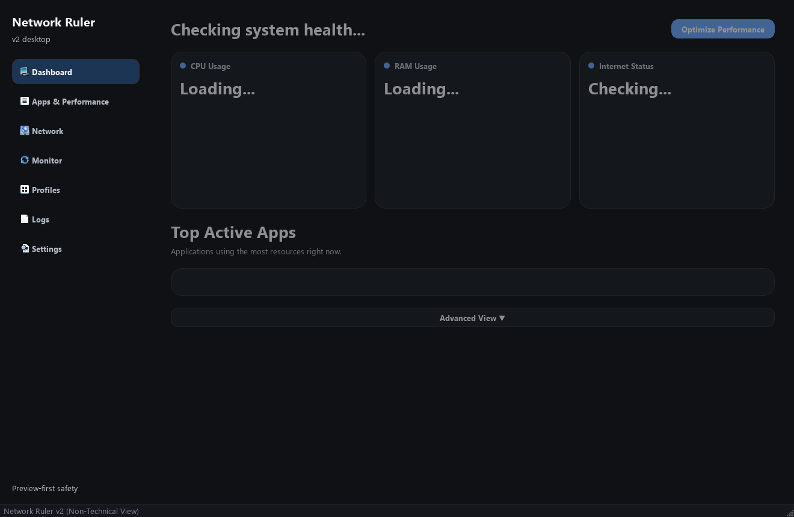
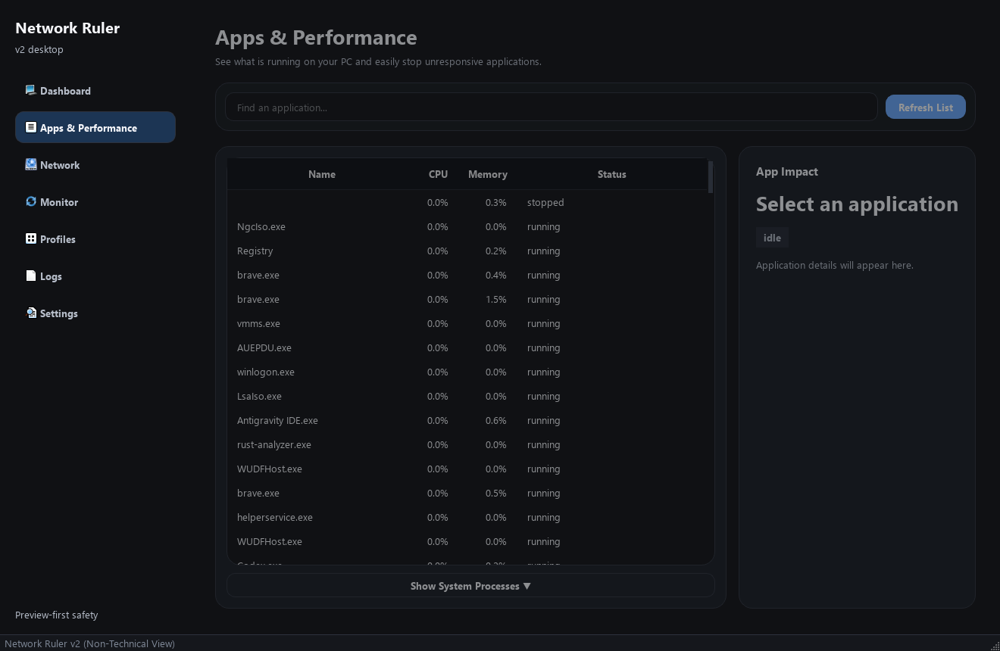
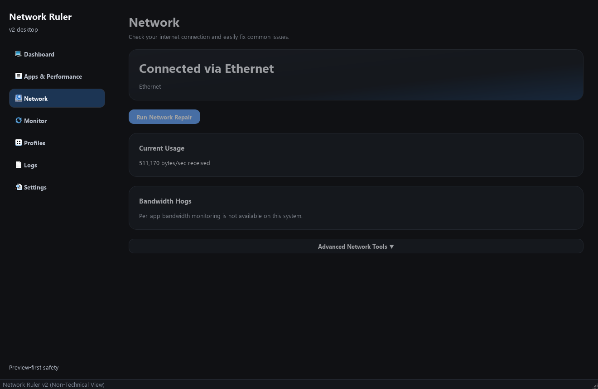
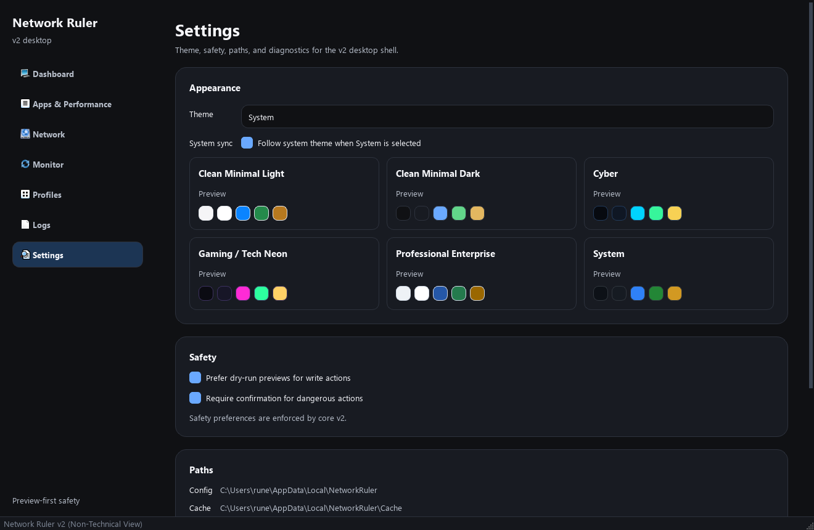
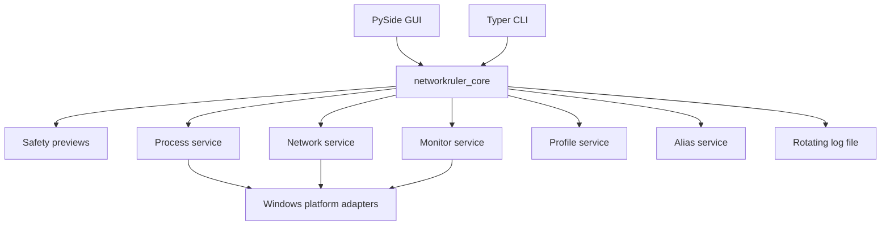

# Network Ruler

Windows-first CLI and desktop toolkit for process visibility, network inspection,
safe repair actions, profiles, aliases, and runtime logs.

Network Ruler v2 is designed around a preview-first workflow: read-only commands
are fast, write actions support dry-run previews, and risky operations require an
explicit confirmation flag.

## Status

- Version: `2.0.0`
- Platform focus: Windows
- Test status: `107 passed`
- Lint status: `ruff check .`
- Release notes: [docs/releases/v2.0.0.md](docs/releases/v2.0.0.md)

## Screenshots

### Dashboard



### Processes



### Network



### Themes



## Features

- Fast CLI shortcuts for process, network, DNS, bandwidth, and path checks.
- Structured command groups for process, network, monitor, profile, alias, and
  config workflows.
- Guarded write actions with `--dry-run` and `--yes`.
- Smart aliases with create, resolve, execute, list, and remove commands.
- Seven-screen PySide desktop GUI: Dashboard, Processes, Network, Monitor,
  Profiles, Logs, and Settings.
- Runtime log file in the user log directory.
- User-scoped config, cache, data, and log paths outside the repository.

Network throttling is not advertised in v2.0.0 because it is not implemented.

## Install

```powershell
python -m pip install -e ".[dev,gui]"
```

Run the CLI:

```powershell
nr
nr doctor
```

Run the GUI:

```powershell
nr-gui
```

## CLI Quick Reference

```powershell
nr ps [text]
nr top --limit 10
nr stat <pid>
nr tree
nr kill <pid|name> --dry-run
nr kill <pid|name> --yes

nr net
nr if
nr wifi
nr ports
nr bw --samples 5
nr dns flush --dry-run
nr dns flush --yes

nr profile list
nr profile validate <name>
nr profile apply <name> --dry-run

nr alias create flush dns flush
nr alias execute flush --dry-run
nr alias resolve flush
nr alias list

nr config paths
```

## Architecture



## Why I Built This

Windows power users often need a quick answer to simple questions: what is
running, what is using the network, what adapter is active, and what repair
action is safe to try next. The first version of Network Ruler proved the idea,
but it mixed old commands, UI experiments, and risky operations too closely.

The v2 goal was to turn that idea into a maintainable tool: split the CLI, GUI,
and core services; move runtime files outside the repo; make write actions
previewable; and keep the desktop interface polished enough to demonstrate the
same workflows visually.

The hardest part was balancing power-user commands with safety. DNS, firewall,
proxy, process, and network actions can be useful, but they should never feel
surprising. That led to the shared safety model and the dry-run-first profile
system.

The main lesson was that credibility comes from alignment: documentation should
match the code, tests should describe the intended product, and visible features
like aliases and logs need to work end to end.

## Development

```powershell
pytest
ruff check .
```

GitHub Actions runs both checks on every push and pull request:

- `.github/workflows/tests.yml`
- `.github/workflows/lint.yml`

## Legacy Code

The `legacy/` directory is archived reference material from the original CLI and
PyQt GUI. It is documented in [legacy/README.md](legacy/README.md), excluded from
ruff, and must not be imported by v2 packages.

## Releases

- `v2.0.0`: Windows-first v2 rebuild with CLI, GUI, profiles, aliases, logging,
  tests, linting, screenshots, and release notes.

Future minor releases should use `v2.1.0`, `v2.2.0`, and so on.

## Author

Built by **RUNEoX**.
